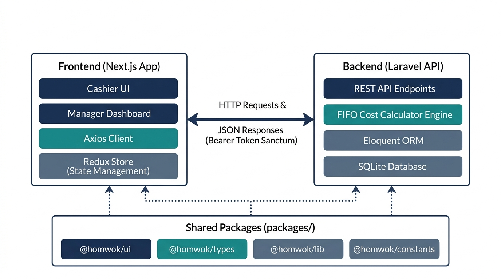

# Rekomendasi Format Dokumentasi Arsitektur Sistem (Skripsi/Tugas Akhir)

Untuk konteks **Arsitektur Sistem (Decoupled Client-Server Monorepo)**, berikut adalah analisis perbandingan opsi yang paling ideal untuk penulisan karya ilmiah:

---

## Analisis Opsi Representasi

| Kriteria Evaluasi | Opsi 1: Tangkapan Layar VS Code | Opsi 2: ASCII Tree (Teks Monospace) | Opsi 3: Tangkapan Layar Terminal |
| :--- | :--- | :--- | :--- |
| **Kerapian Format (Word)** | Cukup rapi, namun berisiko pecah/buram jika diubah ukurannya. | **Sangat Rapi & Bersih**. Mengikuti margin halaman dokumen Word. | Kurang rapi karena memakan ruang hitam kontras yang besar. |
| **Kesesuaian Akademis** | Kurang formal (terlalu kasual untuk bab inti skripsi, lebih cocok untuk Lampiran). | **Sangat Formal**. Mengikuti kaidah standar penulisan kode program/direktori. | Kurang formal (lebih cocok diletakkan pada Lampiran). |
| **Keterbacaan (Searchable)** | Tidak dapat dicari (bukan teks indeks). | **Dapat dicari/copy-paste secara langsung**. | Tidak dapat dicari (bukan teks indeks). |
| **Rekomendasi Penempatan** | **Lampiran** (sebagai bukti pengerjaan riil). | **Bab IV (Implementasi Sistem)**. | **Lampiran** (sebagai bukti eksekusi terminal). |

---

## Strategi Kombinasi Terbaik (Best Practice Akademis)

Untuk bab **Arsitektur Sistem**, struktur terbaik adalah memadukan **Opsi Visual (Diagram Blok)** dengan **Opsi Tekstual (ASCII Tree)**:

### Langkah 1: Tampilkan Diagram Blok Aliran Komunikasi (Visual)
Diagram ini menjelaskan interaksi client-server secara konseptual.


*Gambar 4.x Diagram Blok Arsitektur Client-Server Monorepo Homwok Coffee*

---

### Langkah 2: Tampilkan Penjelasan Struktur Direktori (Teks ASCII)
Setelah diagram, jelaskan bagaimana arsitektur tersebut diterjemahkan ke dalam kode fisik di repositori menggunakan format ASCII Tree (font **Consolas** atau **Courier New**, ukuran **9pt**):

```text
homwok-coffee/                  (Root Repositori Monorepo)
├── apps/
│   ├── api/                    (Backend Server: Laravel API)
│   │   ├── app/
│   │   │   ├── Models/         (Model Eloquent Database SQLite)
│   │   │   └── Services/       (Logika Bisnis: FifoCostCalculator)
│   │   ├── config/             (Konfigurasi Sistem)
│   │   ├── database/           (Migrasi & Seeder Database)
│   │   ├── routes/             (Definisi REST API Endpoints)
│   │   └── tests/              (Pengujian Unit & Feature FIFO)
│   │
│   └── web/                    (Frontend Client: Next.js)
│       └── src/
│           ├── app/            (Rute Kasir & Dashboard Admin)
│           ├── components/     (Komponen Antarmuka Khusus)
│           ├── hooks/          (State Klien: useCart)
│           └── lib/            (Konektor Axios / HTTP Client)
│
├── packages/                   (Modul Bersama / Shared Packages)
│   ├── ui/                     (Perpustakaan Komponen UI Kasir)
│   ├── types/                  (Tipe Data Bersama TypeScript)
│   └── lib/                    (Fungsi Helper Bersama: Format Rupiah)
│
└── package.json                (Manajer Dependensi Repositori)
```
*Gambar 4.y Struktur Pemetaan Direktori Repositori Homwok Coffee*
