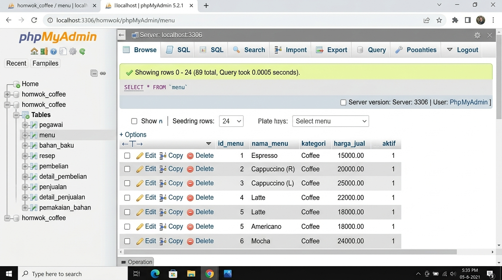

# 4.2.1 Implementasi Data Awal (Database Seeder)

Untuk keperluan pengujian ketahanan logika algoritma persediaan dan kelancaran demonstrasi visual antarmuka, basis data fisik yang telah terbentuk diisi dengan rekaman data awal yang merepresentasikan data riil operasional melalui mekanisme *Database Seeder* pada Laravel. Pengisian data awal dikonfigurasi melalui tiga berkas penabur data (*seeder*) utama:

1. **MenuSeeder**: Mengeksekusi injeksi 89 baris data katalog menu minuman. Katalog produk yang memiliki variasi ukuran saji (seperti tipe Reguler dan Large) dipecah menjadi entri baris tabel yang mandiri dengan konversi nominal harga yang disesuaikan.
2. **BahanBakuSeeder**: Mengeksekusi injeksi 59 entri master bahan mentah (kopi, susu, sirup, bubuk, dan kemasan). Injeksi ini secara otomatis menyertakan satu transaksi pengadaan simulasi bertajuk "Stok Awal" untuk memastikan setiap komponen bahan baku memiliki lot antrean FIFO awal yang aktif pada tabel `detail_pembelian`.
3. **ResepSeeder**: Mengeksekusi pemetaan relasional dekomposisi sebanyak ±349 baris formulasi resep. Sistem dikonfigurasi agar takaran bahan untuk varian menu berukuran Large secara otomatis dikalikan dengan rasio 1,3 dari ukuran standar, serta diiringi penambahan atribut bahan kemasan (paper cup atau botol) secara otomatis berdasarkan kategori produk.

---

### Hasil Eksekusi Penaburan Data (Seeding) pada phpMyAdmin

*Gambar 4.2 Hasil Eksekusi Seeder pada Tabel Basis Data (phpMyAdmin View)*
