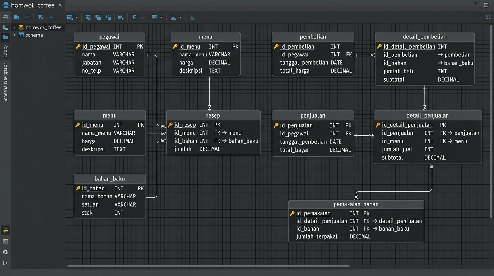

# 4.2 Implementasi Basis Data

Implementasi basis data merupakan tahap perwujudan fisik dari perancangan struktur tabel relasional dan *Entity Relationship Diagram* (ERD) yang telah ditentukan pada BAB III. Pada sistem ini, pembentukan struktur basis data secara fisik di dalam sistem manajemen basis data (DBMS) MySQL tidak dilakukan secara manual, melainkan diimplementasikan melalui mekanisme *Migration* yang terintegrasi pada *framework* Laravel.

Penggunaan berkas migrasi (*migration files*) memastikan bahwa seluruh pembentukan 9 (sembilan) tabel domain utama—yaitu tabel `pegawai` (user), `menu`, `bahan_baku`, `resep`, `pembelian`, `detail_pembelian` (lot FIFO), `penjualan`, `detail_penjualan`, dan `pemakaian_bahan` (log pemakaian FIFO)—dapat dieksekusi secara otomatis dan seragam melalui perintah konsol terminal. Perekaman konstrain kunci primer (*primary key*), relasi kunci tamu (*foreign key*), penggunaan tipe data bilangan desimal pada atribut kuantitas, serta pembuatan indeks komposit khusus pada kolom `id_bahan` dan `sisa_qty` untuk mempercepat kueri pencarian antrean FIFO, seluruhnya terwujud secara mutlak di dalam basis data.

---

### Hasil Implementasi Skema Relasional Fisik (ERD)

*Gambar 4.1 Implementasi Fisik Basis Data pada MySQL (DBeaver Schema)*
