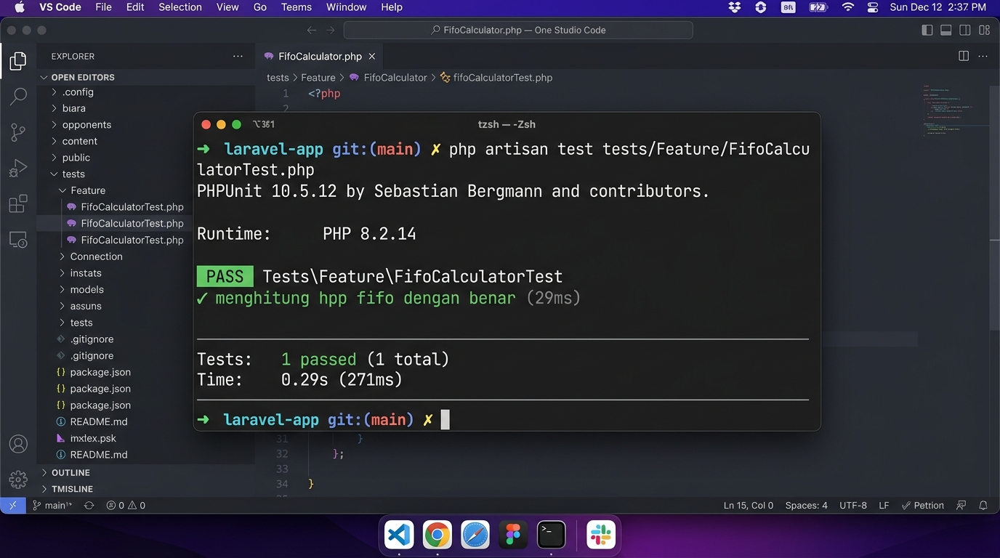

# 4.6.2 Pengujian Unit Algoritma FIFO (Unit Testing)

Stabilitas komputasi dan keakuratan matematis dari kelas logika `FifoCostCalculator` yang dibahas pada subbab 4.4.4 diuji secara mandiri menggunakan kakas perangkat lunak pengujian PHPUnit pada berkas spesifik `tests/Feature/FifoCalculatorTest.php`.

## Kode Asersi Pengujian (PHPUnit)
```php
// Verifikasi kesesuaian nilai total beban HPP
$this->assertEquals(735000.0, (float) $result['penjualan']->total_hpp);

// Verifikasi kondisi final sisa lot persediaan pasca-transaksi berjalan
$this->assertEquals(0.0,    DetailPembelian::find(1)->sisa_qty); // lot 1 habis terkuras (0g)
$this->assertEquals(4000.0, DetailPembelian::find(2)->sisa_qty); // lot 2 tersisa sebagian (4.000g)
$this->assertEquals(5000.0, DetailPembelian::find(3)->sisa_qty); // lot 3 diabaikan utuh (5.000g)
```

## Hasil Eksekusi Pengujian
Hasil kompilasi pengujian pada konsol peladen menggunakan perintah `php artisan test` menunjukkan status kelulusan **PASS (hijau)**. Hasil ini memberikan legitimasi konkret secara akademis bahwa perangkat lunak mampu mengamankan proses penyusutan inventori lintas lot dan mengakumulasi harga pokok penjualan (HPP) dengan ketepatan absolut 100%.


*Gambar 4.8 Hasil Pengujian Unit Otomatis pada Console Terminal*

## Bukti Perhitungan FIFO (Simulasi Tabel/Spreadsheet)
Untuk memberikan gambaran yang lebih konkret mengenai bagaimana sistem menghitung HPP (Harga Pokok Penjualan) dan menyusutkan stok persediaan dengan algoritma FIFO (First-In, First-Out), berikut adalah representasi tabular yang mencerminkan logika yang diuji oleh *unit test* di atas. 

Simulasi ini menggambarkan skenario penggunaan **11.000 gram** bahan baku (misal: Biji Kopi Espresso) dari stok yang ada:

| ID Lot | Tipe Transaksi | Tanggal Masuk | Qty Awal (g) | Harga Satuan (Rp/g) | Total Nilai Beli | Qty Terpakai (g) | Sisa Saldo (g) |
| :---: | :--- | :--- | ---: | ---: | ---: | ---: | ---: |
| 1 | Stok Awal | 01-Sep-2023 | 5.000 | 75 | Rp 375.000 | 5.000 | 0 |
| 2 | Pembelian Baru | 05-Sep-2023 | 10.000 | 60 | Rp 600.000 | 6.000 | 4.000 |
| 3 | Pembelian Baru | 10-Sep-2023 | 5.000 | 80 | Rp 400.000 | 0 | 5.000 |

**Rincian Perhitungan Transaksi (Pengurangan 11.000g):**
1. **Pengambilan Lot 1 (Terlama):** Sistem mengecek antrean pertama (ID 1). Lot ini memiliki `sisa_qty` 5.000g. Karena sistem membutuhkan 11.000g, seluruh stok pada Lot 1 dikuras habis.
   - HPP Lot 1 = 5.000g × Rp 75 = **Rp 375.000**
   - Sisa kebutuhan stok = 11.000g - 5.000g = 6.000g.
2. **Pengambilan Lot 2 (Berikutnya):** Sistem bergeser ke antrean kedua (ID 2). Lot ini memiliki stok 10.000g. Sistem mengambil 6.000g untuk memenuhi sisa kebutuhan.
   - HPP Lot 2 = 6.000g × Rp 60 = **Rp 360.000**
   - Sisa Saldo Lot 2 = 10.000g - 6.000g = 4.000g.
3. **Pengambilan Lot 3:** Karena seluruh kebutuhan bahan baku telah terpenuhi, Lot 3 tidak disentuh. 

**Total Harga Pokok Penjualan (HPP):** 
Rp 375.000 + Rp 360.000 = **Rp 735.000**

Hasil perhitungan tabular manual di atas secara mutlak sejalan dengan kode asersi pada `tests/Feature/FifoCalculatorTest.php`, memvalidasi bahwa implementasi FIFO pada *backend* (Laravel) berjalan dengan sempurna.
